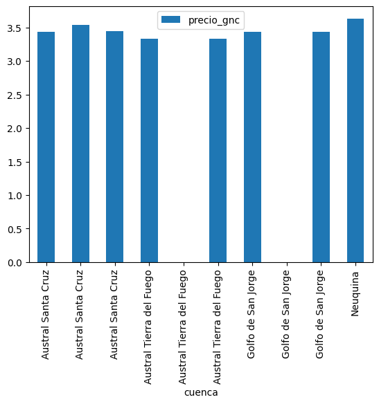

```python
# ● Instalar Pandas en Jupyter Notebook.
# ● Cargar un data frame desde un archivo csv.
# ● Cargar un data frame distinto desde un archivo Excel.
# ● Mostrar los datos de ambos dataframes.
# ● Instalar Pandas y Matplotlib.
# ● Realizar las siguientes acciones sobre el segundo dataframe:
#   - Group By sobre un campo y utilizando sum()
#   - Realizar un Melt
#   - Realizar un gráfico de Barras con el primer dataframe.

import pandas as pd
import matplotlib.pyplot as plt

df_csv = pd.read_csv("/home/cratag/Downloads/precios-de-gas-natural.csv",encoding = "utf-8")
df_excel = pd.read_excel("/home/cratag/Downloads/precios_res1_2018.xlsx")

# Para ver df CSV
df_csv  
# Para ver df Excel
df_excel

# Group by Año y suma de precios.
df_excel.groupby(['Año'])['Precio (USD/MMBTU)'].sum()

# Melt
pd.melt(df_excel, id_vars='Cuenca', value_vars=['Segmento', 'Condición'])

# Barras -- acortado a los primeros 10 porque sino era ilegible.
df_csv.head(10).plot(x ='cuenca', y='precio_gnc', kind = 'bar')
plt.show()
```


    

    


```python

```
