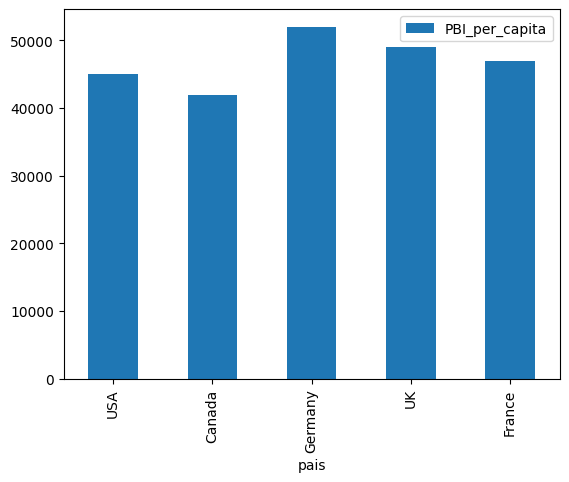

```python
import pandas as pd
import matplotlib.pyplot as plt

# Leer CSV
# df=pd.read_csv("/home/cratag/Downloads/precios-de-gas-natural.csv",encoding = "utf-8")
# print(df)

# Leer Excel
# df=pd.read_excel("/home/cratag/Downloads/precios_res1_2018.xlsx")
# print(df)

# Crear df desde un conjunto de datos
# df1 = pd.DataFrame({'lkey': ['foo', 'bar', 'baz', 'foo'], 'value': [1, 2, 3, 5]})
# df2 = pd.DataFrame({'rkey': ['foo', 'bar', 'baz', 'foo'], 'value': [5, 6, 7, 8]})
# print(df1)

# Crear un df a partir de un escalar
# Df1 = pd.Series (7, index = ["Enero","Febrero","Marzo"])
# print(Df1)

# Crear un df a partir de un array
# mi_array = {'col1': 1.0, 'col2':2.0, 'col3': 3.0}
# df = pd.DataFrame([mi_array])
# print (df)


# Mostrar las primeras 10 filas del CSV:
# print(df1.head(10))

# Contar la cantidad de filas:
# print(len(df1))

# print("Cant. filas: %i" % len(df1))
#El %i indica que ahí va una variable de tipo integer.
#Al cerrar comillas dobles, el % indica qué es lo que debe reemplazar a %i

# print(df1[:10]) #muestra las primeras 10 filas
# print(df1[5:]) #muestra todo salvo las primeras 5 filas
# print(df1[-3:]) #muestra las últimas 3 filas
# print(df1[:-2]) #muestra todo salvo las últimas 2 filas
# print(df1[-5:-2]) #muestra desde la 5ta desde el final hasta 2 desde el final

# Df1 = df1['Keyword'].str.lower()

# Ver las columnas
# print(df1.columns)

# Cómo ver el contenido de una columna en Pandas:
# print(df1['value']) #la columna se llama value

#Cómo sacar el promedio de los valores de una columna en Pandas:
# print(df1['value'].mean())

# Posicionamiento:
# Supongamos que deseamos mostrar el primer row completo, mostrando todas las columnas, del dataframe llamado df1. La sintaxis es la siguiente:
# df1.loc[0,:]

# Usaremos la siguiente sintaxis para mostrar lo mismo que el caso anterior pero para solamente una columna:
# df1.loc[0,:'value']

# Uso de MELT
# df = pd.DataFrame({'equipo': ['A', 'B', 'C', 'D'], 'goles': [100, 200, 300, 400], 'faltas': [1000, 190, 999, 888], 'amonestaciones': [232, 218, 310, 311]})
# df = pd.melt(df, id_vars='equipo', value_vars=['goles', 'faltas', 'amonestaciones'])
# df 

# Uso de Plotting (graficos)

# Scatter
# data = {'tasa_desempleo': [6.1,5.8,5.7,5.7,5.8,5.6,5.5,5.3,5.2,5.2], 'indice_precio_stock': [1500,1520,1525,1523,1515,1540,1545,1560,1555,1565]}
# df = pd.DataFrame(data,columns=['tasa_desempleo','indice_precio_stock'])
# df.plot(x ='tasa_desempleo', y='indice_precio_stock', kind = 'scatter')
# plt.show()

# Linea
# data = {'anio': [1920,1930,1940,1950,1960,1970,1980,1990,2000,2010], 'tasa_desempleo': [9.8,12,8,7.2,6.9,7,6.5,6.2,5.5,6.3]}
# df = pd.DataFrame(data,columns=['anio','tasa_desempleo'])
# df.plot(x ='anio', y='tasa_desempleo', kind = 'line')
# plt.show()

# Barras
# data = {'pais': ['USA','Canada','Germany','UK','France'], 'PBI_per_capita': [45000,42000,52000,49000,47000]}
# df = pd.DataFrame(data,columns=['pais','PBI_per_capita'])
# df.plot(x ='pais', y='PBI_per_capita', kind = 'bar')
# plt.show()


```


    

    

